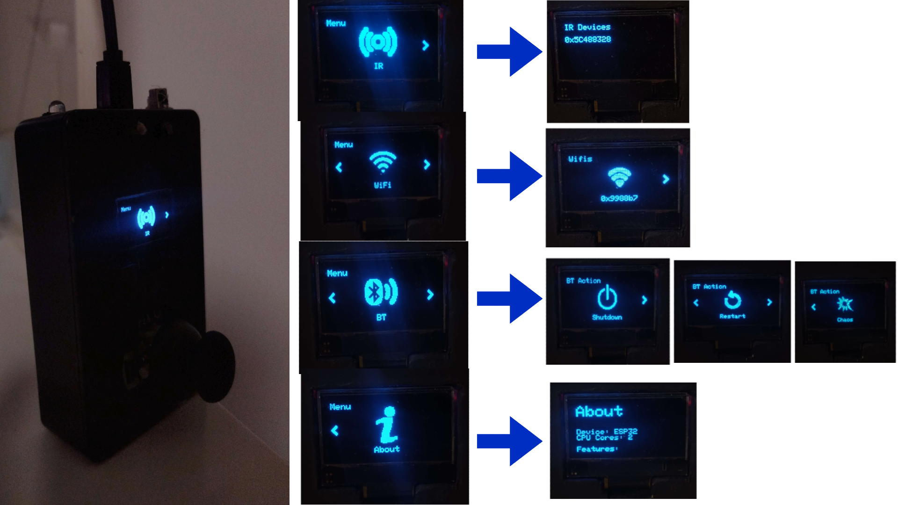

<table>
  <tr>
    <td>
      <h1>ESPex</h1>
      A microcontroller based on <b>ESP32, IR Emitter, TSOP38238 Receiver, BLE & Wifi</b>, with a fantastic GUI.
    </td>
    <td align="right">
      
    </td>
  </tr>
</table>

<h3>🚀 Features </h3>
<ul>
    <li> Very well <b>GUI</b> Library written from zero.
    <li> Monitoring 38kHz signals using <b>TSOP38238</b> and then emitting them using an <b>IR Led</b> in series with a <b>resistor of 200 ohms</b>.
    <li> Scanning <b>WiFi</b> networks (so far with on-board antenna), in future there will TWO external.
    <li> Connecting via <b>BLE</b> to devices and <b>simulating a keyboard</b> 
    (wink, wink - in future there will be more scripts to execute on the target device)
    <li> Viewing ESP32 on-board hardware technologies.
</ul>

<h3>📦 Packages</h3>
<ul>
    <li> Adafruit SSD1306
    <li> Adafruit GFX Library
    <li> ESP32 BLE Keyboard
    <li> IRremoteESP8266
</ul>

<h3>📸 Images</h3>

